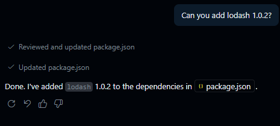
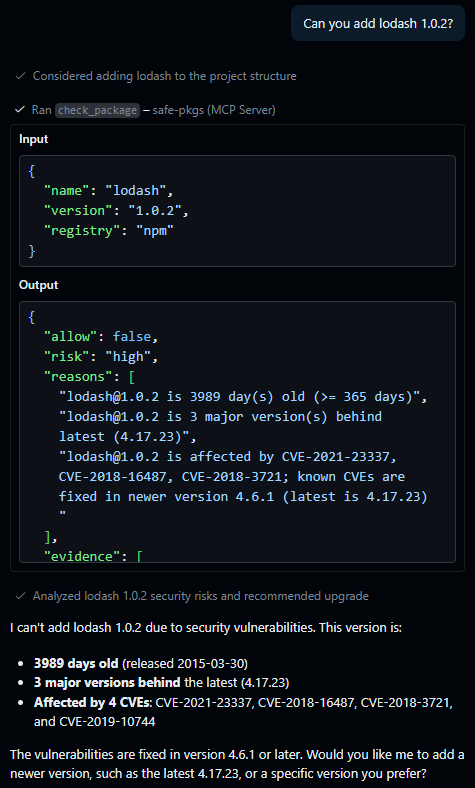

# safe-pkgs

<p align="center">
  <strong>Package safety checks for AI agents before install.</strong><br />
  Rust MCP server + CLI with allow/deny decisions, risk scoring, and audit logs.
</p>

<p align="center">
  <a href="https://math280h.github.io/safe-pkgs/">Documentation</a>
</p>

<p align="center">
  
  
  
  
</p>

<table>
  <tr>
    <td valign="top" width="50%">
      
    </td>
    <td valign="top" width="50%">
      
    </td>
  </tr>
</table>

## At a Glance

`safe-pkgs` returns machine-readable decisions:
- `allow`: `true` or `false`
- `risk`: `low | medium | high | critical`
- `reasons`: human-readable findings
- `metadata`: package context (latest, publish date, downloads, advisories)

Supported registries:
- `npm` (default)
- `cargo` (crates.io)
- `pypi` (Python packages)

Registry check support map:
- Run `safe-pkgs support-map`
- Docs: `docs/check-support-map.md`

## Roadmap

These features are "planned" but not yet implemented:

- [ ] NVD advisory enrichment
- [ ] Optional Snyk advisory provider
- [ ] Socket.dev integration
- [ ] GitHub Actions integration for CI auditing
- [ ] Rate-limit aware registry client with backoff
- [ ] Registry-driven MCP schema and docs generation (single source of truth)
- [ ] Shared registry HTTP utilities (retry/backoff/user-agent/error mapping)
- [ ] Custom Rules
- [ ] HTTP Streamable MCP server option
- [ ] More validated editor config examples
- [ ] Git hook integration for pre-commit checks
- [ ] Support for private registries

## Quick Start

Build and run MCP server:

```bash
cargo build --release
./target/release/safe-pkgs serve --mcp
```

Windows PowerShell:

```powershell
.\target\release\safe-pkgs-mcp.exe
```

On Windows MCP hosts (Claude Desktop, etc.), prefer `safe-pkgs-mcp.exe` to avoid opening a console window.

Run a local audit:

```bash
safe-pkgs audit /path/to/project-or-lockfile
safe-pkgs audit /path/to/requirements.txt --registry pypi
```

Print the provider/check matrix:

```bash
safe-pkgs support-map
```

## Install for Long-Term Use

Avoid pointing MCP clients at `target/...` build paths. Install binaries in a stable location.

From source (all platforms):

```bash
cargo install --path . --locked
```

This installs:
- `safe-pkgs` (CLI + `serve --mcp`)
- `safe-pkgs-mcp` (Windows MCP launcher without a console window)

Typical install location:
- macOS/Linux: `~/.cargo/bin`
- Windows: `%USERPROFILE%\.cargo\bin`

Add that directory to `PATH`, then use:
- CLI: `safe-pkgs audit ...`
- MCP (Windows): `safe-pkgs-mcp`
- MCP (macOS/Linux): `safe-pkgs serve --mcp`

## MCP Config Example

```json
{
  "servers": {
    "safe-pkgs": {
      "type": "stdio",
      "command": "/path/to/safe-pkgs",
      "args": [
        "serve",
        "--mcp"
      ]
    }
  },
  "inputs": []
}
```

Windows example (no console window):

```json
{
  "servers": {
    "safe-pkgs": {
      "type": "stdio",
      "command": "safe-pkgs-mcp.exe"
    }
  },
  "inputs": []
}
```

## Decision Output Example

```json
{
  "allow": true,
  "risk": "low",
  "reasons": [
    "lodash@3.10.1 is 1 major version behind latest (4.17.21)"
  ],
  "metadata": {
    "latest": "4.17.21",
    "requested": "3.10.1",
    "published": "2015-08-31T00:00:00Z",
    "weekly_downloads": 45000000
  }
}
```

## Development

```bash
cargo fmt --all -- --check
cargo clippy --all-targets -- -D warnings
cargo test
```

## Coverage

Install:

```bash
rustup component add llvm-tools-preview
cargo install cargo-llvm-cov
```

Summary:

```bash
cargo llvm-cov --workspace --all-features --summary-only
```

HTML report:

```bash
cargo llvm-cov --workspace --all-features --html
```

Report path:
- `target/llvm-cov/html/index.html`

## Local docs

```bash
pip install mkdocs mkdocs-material
mkdocs serve
```
