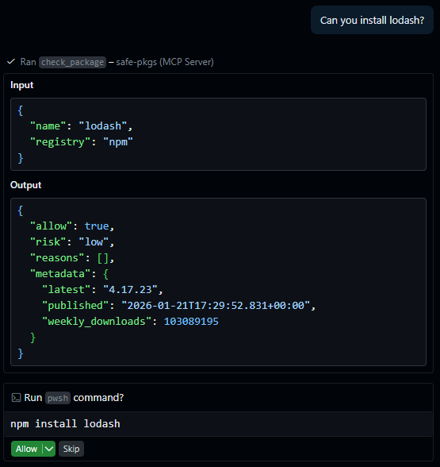
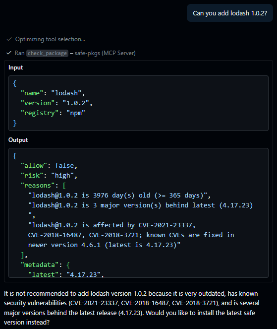

# safe-pkgs

<p align="center">
  <strong>Package safety checks for AI agents before install.</strong><br />
  Rust MCP server + CLI with allow/deny decisions, risk scoring, and audit logs.
</p>

<p align="center">
  
  
  
</p>

<table>
  <tr>
    <td valign="top" width="50%">
      
    </td>
    <td valign="top" width="50%">
      
    </td>
  </tr>
</table>

## At a Glance

`safe-pkgs` returns machine-readable decisions:
- `allow`: `true` or `false`
- `risk`: `low | medium | high | critical`
- `reasons`: human-readable findings
- `metadata`: package context (latest, publish date, downloads, advisories)

Supported registries:
- `npm` (default)
- `cargo` (crates.io)

## Tools and Commands

| Surface | Name | Purpose |
|---|---|---|
| MCP tool | `check_package(name, version?, registry?)` | Check a single package before install |
| MCP tool | `check_lockfile(path?, registry?)` | Batch-check npm `package-lock.json` / `package.json` |
| CLI | `safe-pkgs serve --mcp` | Run MCP server over stdio |
| CLI | `safe-pkgs audit <path>` | Run one-off dependency audit |

## Checks Pipeline

- Existence check
- Version age check
- Staleness check
- Typosquat check
- Popularity check
- Install script check
- Advisory/CVE check

## Roadmap

These features are "planned" but not yet implemented:

- [ ] PyPI registry support
- [ ] NVD advisory enrichment
- [ ] Optional Snyk advisory provider
- [ ] Socket.dev integration
- [ ] GitHub Actions integration for CI auditing
- [ ] Rate-limit aware registry client with backoff
- [ ] Custom Rules
- [ ] HTTP Streamable MCP server option
- [ ] More validated editor config examples
- [ ] Git hook integration for pre-commit checks
- [ ] Support for private registries

## Quick Start

Build and run MCP server:

```bash
cargo build --release
./target/release/safe-pkgs serve --mcp
```

Windows PowerShell:

```powershell
.\target\release\safe-pkgs.exe serve --mcp
```

Run a local audit:

```bash
safe-pkgs audit /path/to/project-or-package.json
```

Audit log file:
- `~/.local/share/safe-pkgs/audit.log`

## MCP Config Example

```json
{
  "servers": {
    "safe-pkgs": {
      "type": "stdio",
      "command": "/path/to/safe-pkgs",
      "args": [
        "serve",
        "--mcp"
      ]
    }
  },
  "inputs": []
}
```

## Decision Output Example

```json
{
  "allow": true,
  "risk": "low",
  "reasons": [
    "lodash@3.10.1 is 1 major version behind latest (4.17.21)"
  ],
  "metadata": {
    "latest": "4.17.21",
    "requested": "3.10.1",
    "published": "2015-08-31T00:00:00Z",
    "weekly_downloads": 45000000
  }
}
```

## Configuration

Global config:
- `~/.config/safe-pkgs/config.toml`

Project override:
- `.safe-pkgs.toml` (merged on top of global)

```toml
min_version_age_days = 7
min_weekly_downloads = 50
max_risk = "medium"

[cache]
ttl_minutes = 30

[staleness]
warn_major_versions_behind = 2
warn_minor_versions_behind = 3
warn_age_days = 365
ignore_for = ["legacy-pkg@1.x"]

[allowlist]
packages = ["my-internal-pkg"]

[denylist]
packages = ["event-stream@3.3.6"]
publishers = ["suspicious-user-123"]
```

## Development

```bash
cargo fmt --all -- --check
cargo clippy --all-targets -- -D warnings
cargo test
```

## Coverage

Install:

```bash
rustup component add llvm-tools-preview
cargo install cargo-llvm-cov
```

Summary:

```bash
cargo llvm-cov --workspace --all-features --summary-only
```

HTML report:

```bash
cargo llvm-cov --workspace --all-features --html
```

Report path:
- `target/llvm-cov/html/index.html`
