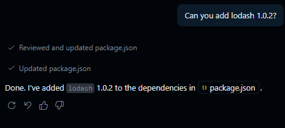
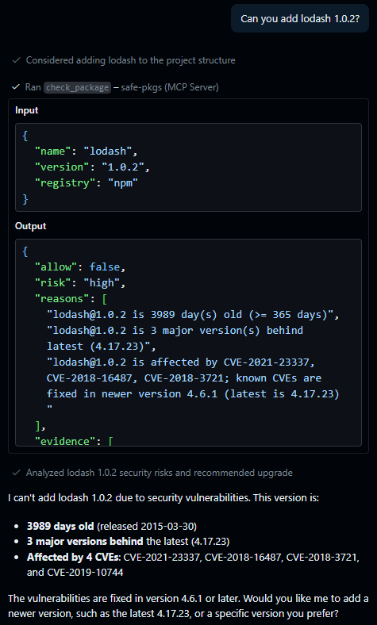

# safe-pkgs

<p align="center">
  <strong>Package safety checks for AI agents before install.</strong><br />
  Rust MCP server + CLI with allow/deny decisions, risk scoring, and audit logs.
</p>

<p align="center">
  <a href="https://math280h.github.io/safe-pkgs/">Documentation</a>
</p>

<p align="center">
  
  
  
  
</p>

<table>
  <tr>
    <td valign="top" width="50%">
      
    </td>
    <td valign="top" width="50%">
      
    </td>
  </tr>
</table>

## What It Is

`safe-pkgs` checks package risk before dependency actions and returns one machine-enforceable decision.

Decision payload includes:
- `allow`: `true` or `false`
- `risk`: `low | medium | high | critical`
- `reasons`: human-readable findings
- `evidence`: structured findings (`kind`, stable `id`, `severity`, `message`, `facts`)
- `metadata`: package context (latest, publish date, downloads, advisories)
- `fingerprints`: deterministic hashes (`config`, `policy`)

## Install + Run in 60 Seconds

Install once:

```bash
cargo install --path . --locked
```

Run MCP server:

```bash
safe-pkgs serve
```

Run a one-off audit:

```bash
safe-pkgs audit /path/to/project-or-lockfile
safe-pkgs audit /path/to/requirements.txt --registry pypi
```

Windows MCP hosts (Claude Desktop, etc.) should use:

```powershell
safe-pkgs-mcp.exe
```

## No Subscription Required

`safe-pkgs` does not require a paid plan, hosted account, or API key for built-in checks.

- Runs locally as a Rust binary (MCP server or CLI).
- Uses public package/advisory endpoints by default:
  - npm registry + npm downloads API + npms popularity index
  - crates.io API
  - PyPI JSON API + pypistats + top-pypi index
  - OSV advisory API
- Stores cache and audit logs locally on your machine.

## Registry and Check Support

Supported registries:
- `npm` (default)
- `cargo` (crates.io)
- `pypi` (Python packages)

View support map:
- Command: `safe-pkgs support-map`
- Docs: `docs/check-support-map.md`

## Configuration

Global file:
- `~/.config/safe-pkgs/config.toml`

Project override:
- `.safe-pkgs.toml` (merged on top of global)

Minimal example:

```toml
min_version_age_days = 7
min_weekly_downloads = 50
max_risk = "medium"

[cache]
ttl_minutes = 30

[allowlist]
packages = ["my-internal-pkg"]

[denylist]
packages = ["event-stream@3.3.6"]
```

Full configuration schema:
- `docs/configuration-spec.md`

## MCP Config Example

macOS/Linux:

```json
{
  "servers": {
    "safe-pkgs": {
      "type": "stdio",
      "command": "/path/to/safe-pkgs",
      "args": ["serve"]
    }
  },
  "inputs": []
}
```

Windows (no console window):

```json
{
  "servers": {
    "safe-pkgs": {
      "type": "stdio",
      "command": "safe-pkgs-mcp.exe"
    }
  },
  "inputs": []
}
```

## Decision Output Example

```json
{
  "allow": true,
  "risk": "low",
  "reasons": [
    "lodash@3.10.1 is 1 major version behind latest (4.17.21)"
  ],
  "evidence": [
    {
      "kind": "check",
      "id": "staleness.behind_latest",
      "severity": "low",
      "message": "lodash@3.10.1 is 1 major version behind latest (4.17.21)",
      "facts": {
        "package_name": "lodash",
        "resolved_version": "3.10.1",
        "latest_version": "4.17.21",
        "major_gap": 1
      }
    }
  ],
  "fingerprints": {
    "config": "c7d9f5b8b9a8f2a9f6b1f42f0e8e8c8a63f2b2ef8fdde1f3cd9ea4f5a2c08a0b",
    "policy": "fca103ee4fd5b86595a6a6e933f8a5f87db0ce087f80744dc1ea9cdbf58f7a6f"
  },
  "metadata": {
    "latest": "4.17.21",
    "requested": "3.10.1",
    "published": "2015-08-31T00:00:00Z",
    "weekly_downloads": 45000000
  }
}
```

## Lockfile Audit Output Example (`dependency_ancestry`)

Input lockfile (`package-lock.json`) used for this example:

```json
{
  "name": "demo",
  "lockfileVersion": 2,
  "dependencies": {
    "react": {
      "version": "18.2.0",
      "dependencies": {
        "loose-envify": {
          "version": "1.4.0"
        }
      }
    }
  }
}
```

Audit output:

```json
{
  "allow": true,
  "risk": "low",
  "total": 2,
  "denied": 0,
  "packages": [
    {
      "name": "react",
      "requested": "18.2.0",
      "allow": true,
      "risk": "low",
      "reasons": [],
      "evidence": []
    },
    {
      "name": "loose-envify",
      "requested": "1.4.0",
      "allow": true,
      "risk": "low",
      "reasons": [],
      "evidence": [],
      "dependency_ancestry": {
        "paths": [
          { "ancestors": ["react"] }
        ]
      }
    }
  ],
  "fingerprints": {
    "config": "<sha256>",
    "policy": "<sha256>"
  }
}
```

`paths[].ancestors` lists only ancestors (root to immediate parent), excluding the package itself.
For direct dependencies, `dependency_ancestry` is omitted.

`evidence.id` is stable and machine-oriented:
- Built-in checks: `<check_id>.<reason_code>` (example: `staleness.behind_latest`)
- Custom rules: `custom_rule.<rule_id>` (example: `custom_rule.low-downloads`)
- Policy/runtime items: explicit IDs (example: `denylist.package`, `risk.medium_pair_escalation`)

## Trust and Security Posture

- Fail-closed behavior: check/runtime failures are surfaced and do not silently allow installs.
- Local audit trail: append-only audit log for decision review.
- Deterministic policy context: responses include `policy_snapshot_version`, config and policy fingerprints, and enabled check set.
- Local cache: SQLite cache keyed by policy fingerprint + package tuple with TTL expiry.

## Disclaimer

`safe-pkgs` works as an MCP tool that AI agents can call before installing packages. However, **we cannot guarantee that an AI agent will always choose to call this tool** — agentic models that autonomously select tools may proceed with package installation without invoking `check_package` or `check_lockfile` first, depending on the model, prompt context, and system prompt configuration.

If your AI agent skipped `safe-pkgs` when it should have called it, please [open an issue](https://github.com/math280h/safe-pkgs/issues/new?template=ai_missed_tool.md) with the prompt and response so we can improve tool descriptions and usage guidance.

## Roadmap

Prioritized planned work:

### Now

- [ ] Dependency confusion defenses for internal/private package names
- [ ] Policy simulation mode (`what-if`) without enforcement
- [ ] Metrics/log schema for latency, cache hit ratio, and registry error rates
- [ ] Support remote audit storage backends
- [ ] Support remote config sources (GitHub repo, HTTP endpoint, etc.)
- [ ] Support for private registries

### Next

- [ ] Policy waivers with expiry
- [ ] Package provenance checks (where ecosystem metadata supports it)
- [ ] Publisher trust signals (account age, maintainer churn, ownership changes)
- [ ] Performance/scale improvements (request coalescing + bounded concurrency for large lockfiles)

### Later

- [ ] NVD advisory enrichment
- [ ] Optional Snyk advisory provider
- [ ] Socket.dev integration
- [ ] GitHub Actions integration for CI auditing
- [ ] Registry-driven MCP schema and docs generation (single source of truth)
- [ ] HTTP Streamable MCP server option
- [ ] More validated editor config examples
- [ ] Git hook integration for pre-commit checks

## Development

```bash
cargo fmt --all -- --check
cargo clippy --all-targets -- -D warnings
cargo test
```

## Coverage

Install:

```bash
rustup component add llvm-tools-preview
cargo install cargo-llvm-cov
```

Summary:

```bash
cargo llvm-cov --workspace --all-features --summary-only
```

HTML report:

```bash
cargo llvm-cov --workspace --all-features --html
```

Report path:
- `target/llvm-cov/html/index.html`

## Local Docs

```bash
pip install mkdocs mkdocs-material
mkdocs serve
```

## Deterministic Evaluation Clock (Optional)

Set `SAFE_PKGS_EVALUATION_TIME` to an RFC3339 timestamp to force a fixed policy evaluation time (useful for replay/debug runs):

```bash
SAFE_PKGS_EVALUATION_TIME=2026-01-01T00:00:00Z safe-pkgs audit /path/to/project
```

```powershell
$env:SAFE_PKGS_EVALUATION_TIME = "2026-01-01T00:00:00Z"
safe-pkgs audit C:\path\to\project
```
