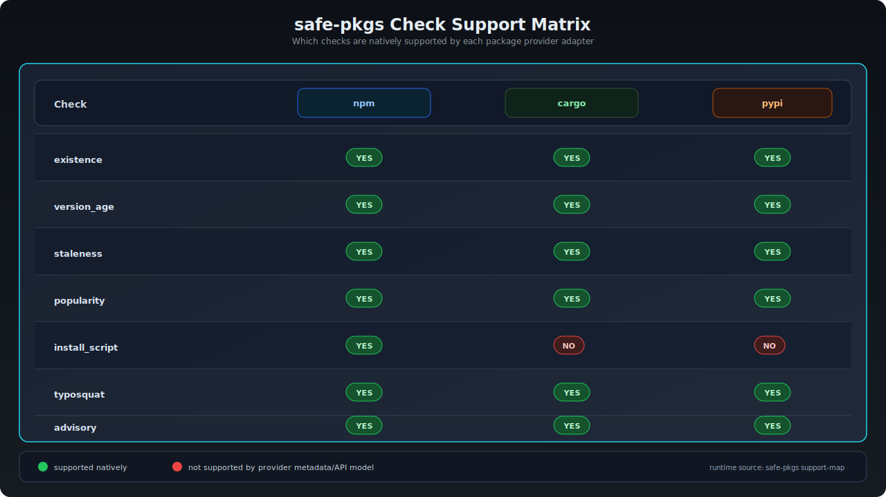

---
hide:
  - title
---

# Check Support Map

Use this matrix to see which checks are available for each provider.



You can print the current matrix directly from the CLI:

```bash
safe-pkgs support-map
```

Per-registry check toggles are configured with:

```toml
[checks]
disable = ["typosquat"]

[checks.registry.cargo]
disable = ["popularity"]
```
