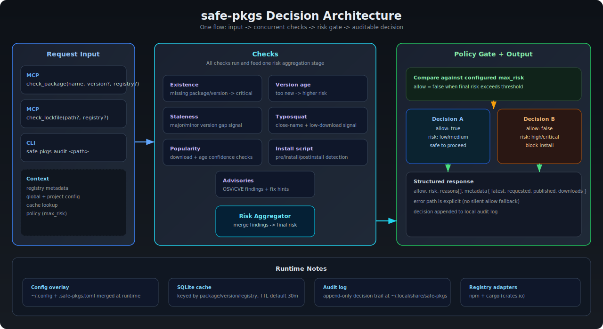

---
hide:
  - title
  - toc
---

  

    
MCP Server + CLI

    <h2>Stop risky packages before they reach your machine.</h2>
    

      safe-pkgs runs package safety checks before install and returns a single decision your tools can enforce:
      <code>allow</code>, <code>risk</code>, <code>reasons</code>, and <code>metadata</code>.
    

    

      <a class="md-button md-button--primary" href="getting-started/">Start in 60 Seconds</a>
      <a class="md-button" href="configuration-spec/">See config spec</a>
    

  

  

    
Typical Decision

    <pre><code>{
  "allow": false,
  "risk": "high",
  "reasons": [
    "package is too new (published 2 days ago)",
    "postinstall script found"
  ],
  "metadata": {
    "latest": "1.2.4",
    "requested": "1.2.3"
  }
}</code></pre>
  

  

    <article class="metric-item"><strong>7 checks</strong>aggregated into one risk score</article>
    <article class="metric-item"><strong>3 registries</strong>npm + crates.io + pypi</article>
    <article class="metric-item"><strong>Audit log</strong>append-only local trail</article>
  

<section class="sp-section">
  

    
Why safe-pkgs

    <h3>Fast installs are great. Blind installs are not.</h3>
  

  

    <article class="sp-card">
      <h4>Catch common supply-chain risk</h4>
      
Typosquat checks, install-script detection, and advisory lookups reduce obvious package abuse before install.

    </article>
    <article class="sp-card">
      <h4>Enforce policy, not vibes</h4>
      
Configure a max allowed risk. If checks fail or risk is too high, the decision is explicit and machine-enforceable.

    </article>
    <article class="sp-card">
      <h4>Keep decisions auditable</h4>
      
Every decision can be logged with reasons and metadata so teams can review what was blocked and why.

    </article>
  

</section>

<section class="sp-section">
  

    
How it works + pipeline

    <h3>One combined decision map.</h3>
  

  
</section>

<section class="sp-section">
  

    
Provider matrix

    <h3>Check support by registry</h3>
  

  
<a class="md-button" href="check-support-map/">Open check support map</a>

</section>

<section class="sp-section">
  

    
In-editor flow

    <h3>What usage looks like</h3>
  

  

    
    
  

</section>

<section class="sp-section">
  

    
How to start

    <h3>Copy, run, integrate.</h3>
  

  

    <article class="code-card">
      <h4>Build and run MCP server</h4>
      <pre><code>cargo build --release
./target/release/safe-pkgs serve --mcp</code></pre>
    </article>
    <article class="code-card">
      <h4>Optional: run one-off audit</h4>
      <pre><code>safe-pkgs audit /path/to/project-or-lockfile</code></pre>
    </article>
    <article class="code-card wide">
      <h4>MCP client config snippet</h4>
      <pre><code>{
  "servers": {
    "safe-pkgs": {
      "type": "stdio",
      "command": "/path/to/safe-pkgs",
      "args": ["serve", "--mcp"]
    }
  },
  "inputs": []
}</code></pre>
    </article>
  

</section>

